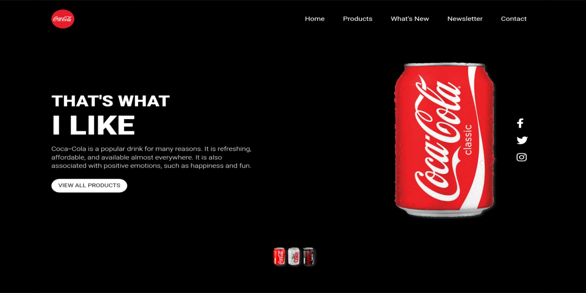

<h1 align='center'>Cocacola Landing Page</h1>

A website for Cocacola-Landing-Page created with HTML & CSS.

🌱 A simple Landing Page for Coca-Cola brand. 

## Design Preview

## Live Demo
👁 [Click here](https://cocacola--ahmedebeed.repl.co) to check out the live demo!

## Technologies Used
* 
*  
*  

## Credits
* Fonts are from [Google Fonts](https://fonts.google.com)
* README Badges are from [Badges Profile](https://github.com/AhmedEbeed)

